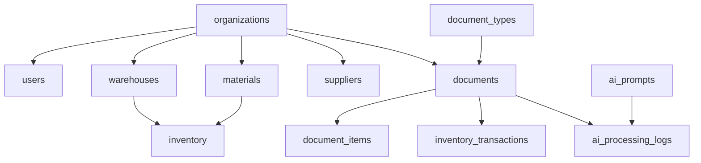

# Hướng Dẫn Setup Database - Supabase

## 📋 Tổng Quan

Project sử dụng Supabase (PostgreSQL) với:
- **12 bảng chính** cho multi-tenant warehouse management
- **Triggers tự động** để cập nhật inventory
- **Row Level Security (RLS)** để bảo mật dữ liệu
- **Seed data** với document types và AI prompts

---

## 🚀 Cách 1: Setup Qua Supabase Dashboard (Khuyến Nghị)

### Bước 1: Tạo Supabase Project

1. Truy cập https://supabase.com
2. Đăng nhập hoặc tạo tài khoản
3. Click **New Project**
4. Điền thông tin:
   - **Name**: `phieu-xuat-nhap` (hoặc tên bạn muốn)
   - **Database Password**: Tạo password mạnh (lưu lại!)
   - **Region**: Chọn gần Việt Nam nhất (Singapore)
5. Click **Create new project**
6. Đợi ~2 phút để project được khởi tạo

### Bước 2: Lấy API Keys

1. Vào **Settings** → **API**
2. Copy các thông tin sau:
   - **Project URL**: `https://xxxxx.supabase.co`
   - **anon public**: `eyJhbGc...` (API key công khai)
   - **service_role**: `eyJhbGc...` (API key bí mật - KHÔNG share)

3. Dán vào file `.env.local`:
```env
NEXT_PUBLIC_SUPABASE_URL=https://xxxxx.supabase.co
NEXT_PUBLIC_SUPABASE_ANON_KEY=eyJhbGc...
SUPABASE_SERVICE_ROLE_KEY=eyJhbGc...
```

### Bước 3: Chạy Database Migrations

1. Vào **SQL Editor** trong Supabase Dashboard
2. Click **New Query**
3. Chạy lần lượt các file SQL:

#### 3.1. Initial Schema (Tạo Tables)

Copy toàn bộ nội dung file `supabase/migrations/20260128000000_initial_schema.sql` và paste vào SQL Editor, sau đó click **Run**.

**Kết quả mong đợi:** 12 bảng được tạo thành công

#### 3.2. Create Triggers

Copy toàn bộ nội dung file `supabase/migrations/20260128000001_create_triggers.sql` và chạy.

**Kết quả mong đợi:** 
- 4 functions được tạo
- 10+ triggers được tạo

#### 3.3. RLS Policies

Copy toàn bộ nội dung file `supabase/migrations/20260128000002_create_rls_policies.sql` và chạy.

**Kết quả mong đợi:** RLS được enable cho tất cả tables

#### 3.4. Seed Data

Copy toàn bộ nội dung file `supabase/migrations/20260128000003_seed_data.sql` và chạy.

**Kết quả mong đợi:**
- 6 document types
- 4 system AI prompts

### Bước 4: Verify Database

1. Vào **Table Editor**
2. Kiểm tra các bảng đã được tạo:
   - ✅ organizations
   - ✅ users
   - ✅ warehouses
   - ✅ materials
   - ✅ suppliers
   - ✅ document_types
   - ✅ documents
   - ✅ document_items
   - ✅ inventory
   - ✅ inventory_transactions
   - ✅ ai_prompts
   - ✅ ai_processing_logs

3. Kiểm tra seed data:
   - Click vào bảng `document_types` → Phải có 6 records
   - Click vào bảng `ai_prompts` → Phải có 4 records

---

## 🔧 Cách 2: Setup Qua Supabase CLI

### Bước 1: Cài Supabase CLI

```bash
npm install -g supabase
```

### Bước 2: Login

```bash
supabase login
```

Browser sẽ mở, đăng nhập vào Supabase.

### Bước 3: Link Project

```bash
cd F:\2026\WebApp\PhieuXuaNhap
supabase link --project-ref your-project-id
```

**Lấy project-id:** Vào Supabase Dashboard → Settings → General → Reference ID

### Bước 4: Push Migrations

```bash
supabase db push
```

Tất cả migrations sẽ được chạy tự động.

---

## 📊 Database Schema Overview

### Core Tables



### Key Features

1. **Multi-tenant**: Mỗi organization có data riêng biệt
2. **Auto Material Code**: Tự động tạo mã vật tư từ tên + đơn vị
3. **Auto Inventory Update**: Trigger tự động cập nhật tồn kho
4. **RLS Security**: Row Level Security bảo vệ data

---

## 🧪 Test Database Connection

### Test 1: Query Document Types

Vào SQL Editor và chạy:

```sql
SELECT * FROM document_types;
```

**Kết quả mong đợi:** 6 rows

### Test 2: Query AI Prompts

```sql
SELECT name, is_system FROM ai_prompts WHERE is_system = true;
```

**Kết quả mong đợi:** 4 system prompts

### Test 3: Test Trigger

```sql
-- Tạo organization test
INSERT INTO organizations (name, slug) 
VALUES ('Test Company', 'test-company')
RETURNING id;

-- Tạo material test (code sẽ tự động generate)
INSERT INTO materials (organization_id, name, unit)
VALUES (
  (SELECT id FROM organizations WHERE slug = 'test-company'),
  'Ống PVC D60',
  'MÉT'
)
RETURNING code;
```

**Kết quả mong đợi:** Material code tự động = `ONG_PVC_D60_MET`

---

## 🔐 Setup Authentication

### Enable Email Auth

1. Vào **Authentication** → **Providers**
2. Enable **Email**
3. Configure:
   - ✅ Enable email confirmations (optional)
   - ✅ Enable email change confirmations
   - ✅ Enable password recovery

### Create First User (Optional)

1. Vào **Authentication** → **Users**
2. Click **Add user**
3. Điền email và password
4. Click **Create user**

**Lưu ý:** User này chưa có organization. Bạn cần tạo organization và link user sau.

---

## 📦 Setup Storage (Cho Upload Ảnh)

### Create Storage Bucket

1. Vào **Storage**
2. Click **New bucket**
3. Điền:
   - **Name**: `documents`
   - **Public**: ✅ (để có thể xem ảnh)
4. Click **Create bucket**

### Setup Storage Policies

Vào bucket `documents` → **Policies** → **New policy**

**Policy 1: Allow authenticated users to upload**
```sql
CREATE POLICY "Authenticated users can upload"
ON storage.objects FOR INSERT
TO authenticated
WITH CHECK (bucket_id = 'documents');
```

**Policy 2: Allow public to view**
```sql
CREATE POLICY "Public can view"
ON storage.objects FOR SELECT
TO public
USING (bucket_id = 'documents');
```

---

## 🐛 Troubleshooting

### Lỗi: "permission denied for schema public"

**Nguyên nhân:** RLS chưa được setup đúng

**Cách khắc phục:**
1. Chạy lại file `20260128000002_create_rls_policies.sql`
2. Đảm bảo user đã đăng nhập và có organization

### Lỗi: "relation does not exist"

**Nguyên nhân:** Tables chưa được tạo

**Cách khắc phục:**
1. Chạy lại file `20260128000000_initial_schema.sql`
2. Kiểm tra trong Table Editor

### Lỗi: Trigger không chạy

**Nguyên nhân:** Triggers chưa được tạo

**Cách khắc phục:**
1. Chạy lại file `20260128000001_create_triggers.sql`
2. Verify trong Database → Functions

---

## 📝 Database Maintenance

### Backup Database

```bash
# Sử dụng Supabase CLI
supabase db dump -f backup.sql
```

### Restore Database

```bash
supabase db reset
supabase db push
```

### View Logs

Vào **Database** → **Logs** để xem query logs và errors.

---

## 🎯 Next Steps

Sau khi setup database thành công:

1. ✅ Test connection từ Next.js app
2. ✅ Tạo organization đầu tiên
3. ✅ Tạo user và link với organization
4. ✅ Test upload document
5. ✅ Test AI processing

---

*Cập nhật lần cuối: 2026-01-28*
