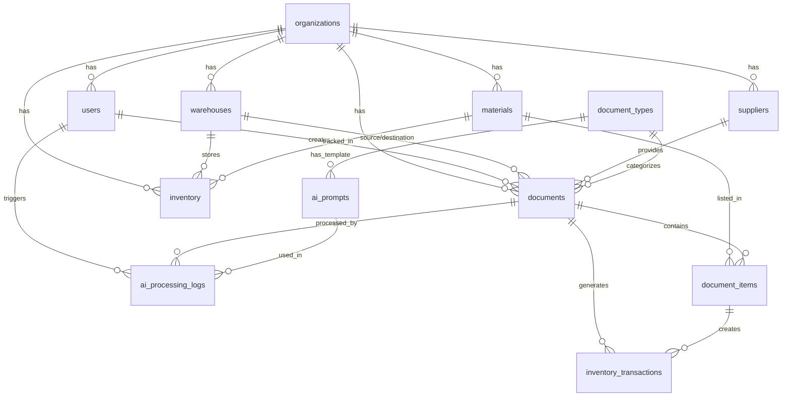

# Implementation Plan: Web App Quản Lý Xuất Nhập Tồn Kho với AI

## Tổng Quan Dự Án

Xây dựng web application cho phép user upload ảnh phiếu nhập/xuất kho, sử dụng AI (Gemini 2.5 Flash) để tự động đọc và trích xuất dữ liệu, lưu vào Supabase, và quản lý báo cáo xuất nhập tồn theo kho và vật tư.

### Yêu Cầu Đã Xác Nhận

✅ **AI Model**: Gemini 2.5 Flash  
✅ **Authentication**: Supabase Auth  
✅ **Multi-tenant**: Có (nhiều công ty dùng chung)  
✅ **Approval Workflow**: Không cần phê duyệt nhiều cấp  
✅ **Barcode**: Không cần  
✅ **Material Code**: Tự động tạo từ `tên vật tư + ĐVT`  

### Phạm Vi Phase 1

> [!IMPORTANT]
> Phase 1 tập trung vào:
> - AI đọc và trích xuất dữ liệu chính xác từ ảnh phiếu
> - Lưu dữ liệu vào Supabase thành công
> - User có thể nhập API Key Gemini
> - Quản lý số phiếu xuất, số phiếu nhập
> - Báo cáo tồn kho theo vật tư

---

## Tech Stack

| Layer | Technology | Lý Do |
|-------|-----------|-------|
| **Frontend** | Next.js 14 + TypeScript | SSR, App Router, Type Safety |
| **Styling** | Tailwind CSS + shadcn/ui | Rapid UI Development, Premium Components |
| **Backend** | Supabase | PostgreSQL, Real-time, Auth, Storage |
| **AI Integration** | Gemini 2.5 Flash | Google's latest vision model |
| **File Upload** | Supabase Storage | CDN, Image optimization |
| **State Management** | Zustand | Lightweight, Simple |
| **Forms** | React Hook Form + Zod | Validation, Type Safety |
| **Charts** | Recharts | Responsive, Customizable |

---

## Database Architecture

### Entity Relationship Diagram



### Core Tables

1. **organizations** - Multi-tenant support
2. **users** - User management with Supabase Auth
3. **warehouses** - Warehouse master data
4. **materials** - Material master data (auto-generated code)
5. **suppliers** - Supplier master data
6. **document_types** - Document type definitions
7. **documents** - Document headers (nhập/xuất/điều chuyển)
8. **document_items** - Document line items
9. **inventory** - Current stock levels (auto-updated)
10. **inventory_transactions** - Transaction history
11. **ai_prompts** - Customizable AI prompts
12. **ai_processing_logs** - AI processing audit trail

---

## Project Structure

```
F:/2026/WebApp/PhieuXuaNhap/
├── project_plan/
│   ├── implementation_plan.md (this file)
│   ├── database_design.md
│   └── api_documentation.md
├── supabase/
│   ├── migrations/
│   │   ├── 20260128000000_initial_schema.sql
│   │   ├── 20260128000001_create_triggers.sql
│   │   ├── 20260128000002_create_rls_policies.sql
│   │   └── 20260128000003_seed_data.sql
│   └── config.toml
├── src/
│   ├── app/
│   │   ├── (auth)/
│   │   │   ├── login/page.tsx
│   │   │   └── register/page.tsx
│   │   ├── (dashboard)/
│   │   │   ├── layout.tsx
│   │   │   ├── page.tsx (Dashboard)
│   │   │   ├── documents/
│   │   │   │   ├── page.tsx (List)
│   │   │   │   ├── new/page.tsx (Upload & AI Processing)
│   │   │   │   └── [id]/page.tsx (Detail)
│   │   │   ├── inventory/
│   │   │   │   ├── page.tsx (By Warehouse)
│   │   │   │   └── materials/page.tsx (By Material)
│   │   │   ├── materials/page.tsx
│   │   │   ├── warehouses/page.tsx
│   │   │   ├── reports/page.tsx
│   │   │   └── settings/
│   │   │       ├── page.tsx
│   │   │       ├── ai/page.tsx
│   │   │       └── prompts/page.tsx
│   │   ├── api/
│   │   │   └── ai/
│   │   │       └── process/route.ts
│   │   └── layout.tsx
│   ├── components/
│   │   ├── ui/ (shadcn components)
│   │   ├── layout/
│   │   ├── documents/
│   │   ├── inventory/
│   │   └── ai/
│   ├── lib/
│   │   ├── supabase/
│   │   ├── ai/
│   │   ├── utils.ts
│   │   └── validations.ts
│   ├── hooks/
│   └── stores/
├── public/
├── .env.local
├── next.config.js
├── tailwind.config.ts
├── tsconfig.json
└── package.json
```

---

## Implementation Timeline

### Day 1: Project Setup & Database
- ✅ Initialize Next.js project
- ✅ Create Supabase database schema
- ✅ Setup authentication
- ✅ Configure environment variables

### Day 2: Authentication & Layout
- ⬜ Implement login/register pages
- ⬜ Create dashboard layout
- ⬜ Setup protected routes
- ⬜ Build sidebar navigation

### Day 3: AI Integration
- ⬜ Implement Gemini API client
- ⬜ Create prompt templates
- ⬜ Build AI processing endpoint
- ⬜ Test AI extraction accuracy

### Day 4: Document Upload
- ⬜ Build upload UI with drag & drop
- ⬜ Integrate Supabase Storage
- ⬜ Create AI processing flow
- ⬜ Build review/edit form

### Day 5: Document Management
- ⬜ Create document list page
- ⬜ Build document detail page
- ⬜ Implement filters & search
- ⬜ Add CRUD operations

### Day 6: Inventory Tracking
- ⬜ Build inventory dashboard
- ⬜ Create inventory by warehouse view
- ⬜ Create inventory by material view
- ⬜ Implement low stock alerts

### Day 7: Reports & Dashboard
- ⬜ Build main dashboard with stats
- ⬜ Create reports page
- ⬜ Implement charts
- ⬜ Add export functionality

### Day 8: Settings & Prompts
- ⬜ Build AI settings page
- ⬜ Create prompt management
- ⬜ Implement API key encryption
- ⬜ Add prompt editor

### Day 9: Testing & Deployment
- ⬜ Test all features
- ⬜ Fix bugs
- ⬜ Deploy to Vercel
- ⬜ User acceptance testing

---

## Key Features

### 1. Document Upload & AI Processing

**Flow:**
1. User uploads multiple images (drag & drop)
2. Images saved to Supabase Storage
3. User selects AI prompt template
4. System calls Gemini 2.5 Flash API
5. AI extracts structured data
6. User reviews and edits extracted data
7. Save to database → Auto-update inventory

**AI Extraction Fields:**
- Document type (auto-detect)
- Document number & date
- Warehouse info
- Supplier/Customer info
- Delivery info
- Line items (material name, quantity, unit)
- Signatures

### 2. Automatic Inventory Management

**Triggers:**
- When document status = 'completed'
- Auto-create material if not exists (using name + unit)
- Update inventory table
- Create transaction records
- Support IN/OUT/TRANSFER operations

### 3. Multi-tenant Support

**Features:**
- Organization-based data isolation
- Row Level Security (RLS)
- User belongs to one organization
- Shared codebase, separate data

### 4. Customizable AI Prompts

**Features:**
- Default system prompts
- User can create custom prompts
- Prompt templates per document type
- Version control for prompts
- Test prompt before saving

### 5. Comprehensive Reports

**Report Types:**
- Nhập kho theo thời gian
- Xuất kho theo thời gian
- Tồn kho hiện tại
- Lịch sử giao dịch theo vật tư
- Lịch sử giao dịch theo kho

---

## Security Considerations

### Authentication
- Supabase Auth with email/password
- JWT tokens for API calls
- Secure session management

### Data Isolation
- Row Level Security (RLS) policies
- Organization-based filtering
- User role-based access control

### API Key Security
- Encrypted storage in database
- Never exposed to client
- Server-side API calls only

### File Upload Security
- File type validation
- Size limits
- Virus scanning (future)

---

## Performance Optimization

### Database
- Proper indexing on foreign keys
- Materialized views for reports (future)
- Query optimization

### Frontend
- Server-side rendering (SSR)
- Image optimization with Next.js
- Code splitting
- Lazy loading

### AI Processing
- Batch processing support
- Async processing with status updates
- Caching of common extractions

---

## Success Metrics

### Phase 1 Goals

✅ **AI Accuracy**: >85% confidence score  
✅ **Processing Time**: <10 seconds per document  
✅ **User Satisfaction**: Easy to use, minimal manual editing  
✅ **Data Integrity**: 100% accurate inventory calculations  
✅ **Multi-tenant**: Complete data isolation  

---

## Future Enhancements (Phase 2+)

- 📱 Mobile app (React Native)
- 📊 Advanced analytics & forecasting
- 🔔 Real-time notifications
- 📧 Email alerts for low stock
- 🔗 Integration with accounting systems
- 🏷️ Barcode/QR code scanning
- 📦 Batch & expiry tracking
- 🌐 Multi-language support
- 📈 Predictive inventory management
- 🤖 Auto-approval workflows

---

## Support & Maintenance

### Documentation
- API documentation
- User guide
- Admin guide
- Troubleshooting guide

### Monitoring
- Error tracking (Sentry)
- Performance monitoring
- Usage analytics
- AI processing logs

### Backup & Recovery
- Daily database backups
- Point-in-time recovery
- Disaster recovery plan

---

## Contact & Resources

- **Project Repository**: TBD
- **Supabase Project**: TBD
- **Deployment**: Vercel
- **AI Model**: Gemini 2.5 Flash

---

*Last Updated: 2026-01-28*
